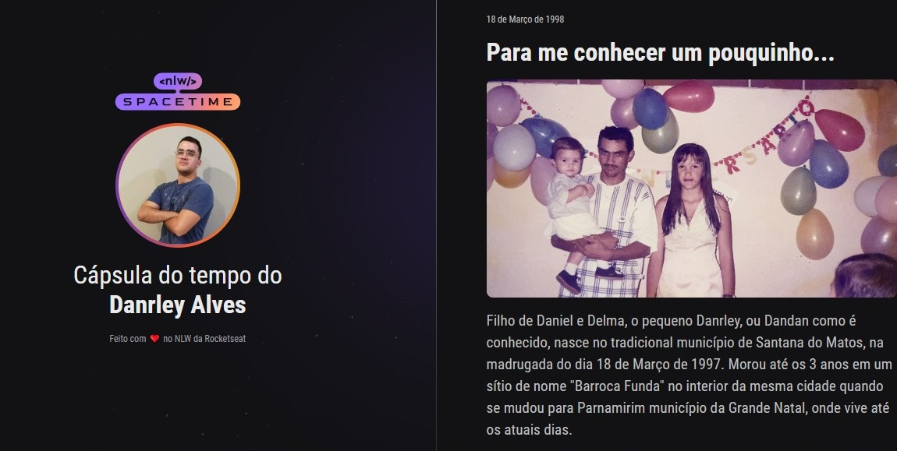

  

## Projeto
  Projeto Web responsivo de uma cápsula do tempo para exibir memórias em uma linha do tempo.

## Tecnologias
  Esse projeto foi desenvolvido utilizando as seguintes tecnologias:
  - HTML
  - CSS
  - Git e Github

## Layout
  Você pode visualizar o layout desse projeto através
[desse link](https://www.figma.com/file/k4d0q8QkePtigrYD23xeLx/C%C3%A1psula-do-tempo-%E2%80%A2-Trilha-Explorer(Copy)?type=design&node-id=306%3A3&t=Zg2E2DUzcXrcVk1S-1)
É necessário ter uma conta registrada no [Figma](https://www.figma.com)
 